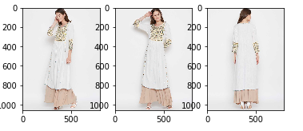
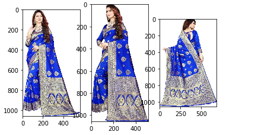
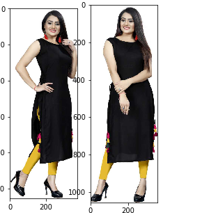
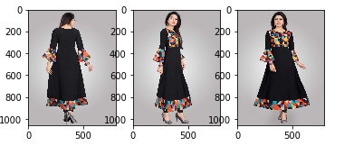
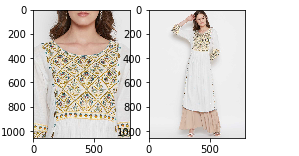
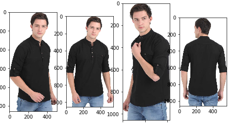
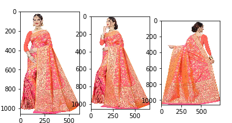
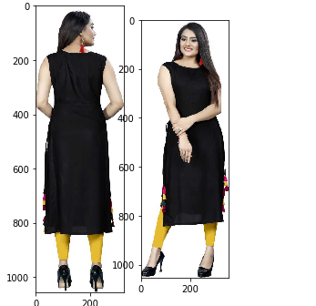

# Product Images Grouping

#### Problem Statement:
Given a dataset of multiple images of different products, the task is to group the images into the distinct products.

dataset folder: ```src/pics/```

#### How can we solve this?

***Let's first understand the dataset.***
 
 * We have a dataset of multiple images of different products without any extra information. Neither we have their class labels/ attributes or what all images are belongs to which products. So that neither we can pre-train or fine-tune our data using supervised  or semi supervised learning. 
 * So we can redefine this problem as __Build an unsupervised learning model or an algorithm for finding and grouping all similar images of a product.__
 
 
 ***What all approach we can give.***
 
 * For Finding the same images of product we have to find a similarity features or criteria by which we can group them. Here I have listed some of the approaches.
 
 1) Hashing the images using several hash algorithm. Find the similar bit count products and group them. Those algorithms can be : [perceptual hashing](http://www.hackerfactor.com/blog/index.php?/archives/432-Looks-Like-It.html), [difference hashing](http://www.hackerfactor.com/blog/index.php?/archives/529-Kind-of-Like-That.html), [average hashing](http://www.hackerfactor.com/blog/index.php?/archives/432-Looks-Like-It.html), etc.
 
    demerits: This Will work in between two exact product images or highly similar images. But will fail drastically if the model in two images are different or if one is catalogue pic and second one is model pic etc..
    
 2) Removing the background and skin of the image and compare the pixel similarities of images to group them.
 
    demerits: This will fail one image has full picture of dress and another one has half or when two images have multiple different views.
    
 3)  Identify the different attribute of a products and group them according to their no of matching attributes.
    
     demerits: Here It will be hard to get exact attribute features or information from a single model. We have to take different model for different attributes and we need too many rule based algorithm which will be much more complex.
     
 4) **Taking a pre-trained imagenet model and extracting any of flatten layer as feature vector and applying K-Nearest Neighour algorithm to group the most similar images of a product.**
 
    demerits: As it is trained on a large dataset it will not help to get very fine grained feature. Although it will perform good for majority person of the data but in some cases it will fail. Because may be the model has not seen those kind of data previously. In vector space, it will maintain huge distances for two images (one of bottomware and another as topware) and very low distance for (half sleeve topware and full sleeve topware ). Because model has trainedon huge classes where it needed to be pre-train or fine tune on a domain specific dataset.
    
    
    I have implemented the 4th approach in python. you can check the attached ipynb or python file.
 
#### Logic & Implementation
* I have used RESNET50 (alexnet pretrained model) as the base model for feature extraction.
    
    ```python
    # Importing RESNET50 model from keras applications.
    base_model = ResNet50(weights='imagenet')
    # Using base model reconstructing a New mode which input will be my baemodel input and output will be 2nd last layer.
    # (2nd last layer in Resnet is last pooling block which give a fixed 2048 embedding feature vectors for any image input)
    model = Model(inputs=base_model.input, outputs=base_model.layers[-2].output)
    ```
    
    <details><summary>Model Summary</summary>
    <p>
      
    ```python
    # printing model summary
    model.summary()
    ```
    
        __________________________________________________________________________________________________
        Layer (type)                    Output Shape         Param #     Connected to                     
        ==================================================================================================
        input_1 (InputLayer)            (None, 224, 224, 3)  0                                            
        __________________________________________________________________________________________________
        conv1_pad (ZeroPadding2D)       (None, 230, 230, 3)  0           input_1[0][0]                    
        __________________________________________________________________________________________________
        conv1 (Conv2D)                  (None, 112, 112, 64) 9472        conv1_pad[0][0]                  
        __________________________________________________________________________________________________
        bn_conv1 (BatchNormalization)   (None, 112, 112, 64) 256         conv1[0][0]                      
        __________________________________________________________________________________________________
        activation_1 (Activation)       (None, 112, 112, 64) 0           bn_conv1[0][0]                   
        __________________________________________________________________________________________________
        max_pooling2d_1 (MaxPooling2D)  (None, 55, 55, 64)   0           activation_1[0][0]               
        __________________________________________________________________________________________________
        res2a_branch2a (Conv2D)         (None, 55, 55, 64)   4160        max_pooling2d_1[0][0]            
        __________________________________________________________________________________________________
        bn2a_branch2a (BatchNormalizati (None, 55, 55, 64)   256         res2a_branch2a[0][0]             
        __________________________________________________________________________________________________
        activation_2 (Activation)       (None, 55, 55, 64)   0           bn2a_branch2a[0][0]              
        __________________________________________________________________________________________________
        res2a_branch2b (Conv2D)         (None, 55, 55, 64)   36928       activation_2[0][0]               
        __________________________________________________________________________________________________
        bn2a_branch2b (BatchNormalizati (None, 55, 55, 64)   256         res2a_branch2b[0][0]             
        __________________________________________________________________________________________________
        activation_3 (Activation)       (None, 55, 55, 64)   0           bn2a_branch2b[0][0]              
        __________________________________________________________________________________________________
        res2a_branch2c (Conv2D)         (None, 55, 55, 256)  16640       activation_3[0][0]               
        __________________________________________________________________________________________________
        res2a_branch1 (Conv2D)          (None, 55, 55, 256)  16640       max_pooling2d_1[0][0]            
        __________________________________________________________________________________________________
        bn2a_branch2c (BatchNormalizati (None, 55, 55, 256)  1024        res2a_branch2c[0][0]             
        __________________________________________________________________________________________________
        bn2a_branch1 (BatchNormalizatio (None, 55, 55, 256)  1024        res2a_branch1[0][0]              
        __________________________________________________________________________________________________
        add_1 (Add)                     (None, 55, 55, 256)  0           bn2a_branch2c[0][0]              
                                                                         bn2a_branch1[0][0]               
        __________________________________________________________________________________________________
        activation_4 (Activation)       (None, 55, 55, 256)  0           add_1[0][0]                      
        __________________________________________________________________________________________________
        res2b_branch2a (Conv2D)         (None, 55, 55, 64)   16448       activation_4[0][0]               
        __________________________________________________________________________________________________
        bn2b_branch2a (BatchNormalizati (None, 55, 55, 64)   256         res2b_branch2a[0][0]             
        __________________________________________________________________________________________________
        activation_5 (Activation)       (None, 55, 55, 64)   0           bn2b_branch2a[0][0]              
        __________________________________________________________________________________________________
        res2b_branch2b (Conv2D)         (None, 55, 55, 64)   36928       activation_5[0][0]               
        __________________________________________________________________________________________________
        bn2b_branch2b (BatchNormalizati (None, 55, 55, 64)   256         res2b_branch2b[0][0]             
        __________________________________________________________________________________________________
        activation_6 (Activation)       (None, 55, 55, 64)   0           bn2b_branch2b[0][0]              
        __________________________________________________________________________________________________
        res2b_branch2c (Conv2D)         (None, 55, 55, 256)  16640       activation_6[0][0]               
        __________________________________________________________________________________________________
        bn2b_branch2c (BatchNormalizati (None, 55, 55, 256)  1024        res2b_branch2c[0][0]             
        __________________________________________________________________________________________________
        add_2 (Add)                     (None, 55, 55, 256)  0           bn2b_branch2c[0][0]              
                                                                         activation_4[0][0]               
        __________________________________________________________________________________________________
        activation_7 (Activation)       (None, 55, 55, 256)  0           add_2[0][0]                      
        __________________________________________________________________________________________________
        res2c_branch2a (Conv2D)         (None, 55, 55, 64)   16448       activation_7[0][0]               
        __________________________________________________________________________________________________
        bn2c_branch2a (BatchNormalizati (None, 55, 55, 64)   256         res2c_branch2a[0][0]             
        __________________________________________________________________________________________________
        activation_8 (Activation)       (None, 55, 55, 64)   0           bn2c_branch2a[0][0]              
        __________________________________________________________________________________________________
        res2c_branch2b (Conv2D)         (None, 55, 55, 64)   36928       activation_8[0][0]               
        __________________________________________________________________________________________________
        bn2c_branch2b (BatchNormalizati (None, 55, 55, 64)   256         res2c_branch2b[0][0]             
        __________________________________________________________________________________________________
        activation_9 (Activation)       (None, 55, 55, 64)   0           bn2c_branch2b[0][0]              
        __________________________________________________________________________________________________
        res2c_branch2c (Conv2D)         (None, 55, 55, 256)  16640       activation_9[0][0]               
        __________________________________________________________________________________________________
        bn2c_branch2c (BatchNormalizati (None, 55, 55, 256)  1024        res2c_branch2c[0][0]             
        __________________________________________________________________________________________________
        add_3 (Add)                     (None, 55, 55, 256)  0           bn2c_branch2c[0][0]              
                                                                         activation_7[0][0]               
        __________________________________________________________________________________________________
        activation_10 (Activation)      (None, 55, 55, 256)  0           add_3[0][0]                      
        __________________________________________________________________________________________________
        res3a_branch2a (Conv2D)         (None, 28, 28, 128)  32896       activation_10[0][0]              
        __________________________________________________________________________________________________
        bn3a_branch2a (BatchNormalizati (None, 28, 28, 128)  512         res3a_branch2a[0][0]             
        __________________________________________________________________________________________________
        activation_11 (Activation)      (None, 28, 28, 128)  0           bn3a_branch2a[0][0]              
        __________________________________________________________________________________________________
        res3a_branch2b (Conv2D)         (None, 28, 28, 128)  147584      activation_11[0][0]              
        __________________________________________________________________________________________________
        bn3a_branch2b (BatchNormalizati (None, 28, 28, 128)  512         res3a_branch2b[0][0]             
        __________________________________________________________________________________________________
        activation_12 (Activation)      (None, 28, 28, 128)  0           bn3a_branch2b[0][0]              
        __________________________________________________________________________________________________
        res3a_branch2c (Conv2D)         (None, 28, 28, 512)  66048       activation_12[0][0]              
        __________________________________________________________________________________________________
        res3a_branch1 (Conv2D)          (None, 28, 28, 512)  131584      activation_10[0][0]              
        __________________________________________________________________________________________________
        bn3a_branch2c (BatchNormalizati (None, 28, 28, 512)  2048        res3a_branch2c[0][0]             
        __________________________________________________________________________________________________
        bn3a_branch1 (BatchNormalizatio (None, 28, 28, 512)  2048        res3a_branch1[0][0]              
        __________________________________________________________________________________________________
        add_4 (Add)                     (None, 28, 28, 512)  0           bn3a_branch2c[0][0]              
                                                                         bn3a_branch1[0][0]               
        __________________________________________________________________________________________________
        activation_13 (Activation)      (None, 28, 28, 512)  0           add_4[0][0]                      
        __________________________________________________________________________________________________
        res3b_branch2a (Conv2D)         (None, 28, 28, 128)  65664       activation_13[0][0]              
        __________________________________________________________________________________________________
        bn3b_branch2a (BatchNormalizati (None, 28, 28, 128)  512         res3b_branch2a[0][0]             
        __________________________________________________________________________________________________
        activation_14 (Activation)      (None, 28, 28, 128)  0           bn3b_branch2a[0][0]              
        __________________________________________________________________________________________________
        res3b_branch2b (Conv2D)         (None, 28, 28, 128)  147584      activation_14[0][0]              
        __________________________________________________________________________________________________
        bn3b_branch2b (BatchNormalizati (None, 28, 28, 128)  512         res3b_branch2b[0][0]             
        __________________________________________________________________________________________________
        activation_15 (Activation)      (None, 28, 28, 128)  0           bn3b_branch2b[0][0]              
        __________________________________________________________________________________________________
        res3b_branch2c (Conv2D)         (None, 28, 28, 512)  66048       activation_15[0][0]              
        __________________________________________________________________________________________________
        bn3b_branch2c (BatchNormalizati (None, 28, 28, 512)  2048        res3b_branch2c[0][0]             
        __________________________________________________________________________________________________
        add_5 (Add)                     (None, 28, 28, 512)  0           bn3b_branch2c[0][0]              
                                                                         activation_13[0][0]              
        __________________________________________________________________________________________________
        activation_16 (Activation)      (None, 28, 28, 512)  0           add_5[0][0]                      
        __________________________________________________________________________________________________
        res3c_branch2a (Conv2D)         (None, 28, 28, 128)  65664       activation_16[0][0]              
        __________________________________________________________________________________________________
        bn3c_branch2a (BatchNormalizati (None, 28, 28, 128)  512         res3c_branch2a[0][0]             
        __________________________________________________________________________________________________
        activation_17 (Activation)      (None, 28, 28, 128)  0           bn3c_branch2a[0][0]              
        __________________________________________________________________________________________________
        res3c_branch2b (Conv2D)         (None, 28, 28, 128)  147584      activation_17[0][0]              
        __________________________________________________________________________________________________
        bn3c_branch2b (BatchNormalizati (None, 28, 28, 128)  512         res3c_branch2b[0][0]             
        __________________________________________________________________________________________________
        activation_18 (Activation)      (None, 28, 28, 128)  0           bn3c_branch2b[0][0]              
        __________________________________________________________________________________________________
        res3c_branch2c (Conv2D)         (None, 28, 28, 512)  66048       activation_18[0][0]              
        __________________________________________________________________________________________________
        bn3c_branch2c (BatchNormalizati (None, 28, 28, 512)  2048        res3c_branch2c[0][0]             
        __________________________________________________________________________________________________
        add_6 (Add)                     (None, 28, 28, 512)  0           bn3c_branch2c[0][0]              
                                                                         activation_16[0][0]              
        __________________________________________________________________________________________________
        activation_19 (Activation)      (None, 28, 28, 512)  0           add_6[0][0]                      
        __________________________________________________________________________________________________
        res3d_branch2a (Conv2D)         (None, 28, 28, 128)  65664       activation_19[0][0]              
        __________________________________________________________________________________________________
        bn3d_branch2a (BatchNormalizati (None, 28, 28, 128)  512         res3d_branch2a[0][0]             
        __________________________________________________________________________________________________
        activation_20 (Activation)      (None, 28, 28, 128)  0           bn3d_branch2a[0][0]              
        __________________________________________________________________________________________________
        res3d_branch2b (Conv2D)         (None, 28, 28, 128)  147584      activation_20[0][0]              
        __________________________________________________________________________________________________
        bn3d_branch2b (BatchNormalizati (None, 28, 28, 128)  512         res3d_branch2b[0][0]             
        __________________________________________________________________________________________________
        activation_21 (Activation)      (None, 28, 28, 128)  0           bn3d_branch2b[0][0]              
        __________________________________________________________________________________________________
        res3d_branch2c (Conv2D)         (None, 28, 28, 512)  66048       activation_21[0][0]              
        __________________________________________________________________________________________________
        bn3d_branch2c (BatchNormalizati (None, 28, 28, 512)  2048        res3d_branch2c[0][0]             
        __________________________________________________________________________________________________
        add_7 (Add)                     (None, 28, 28, 512)  0           bn3d_branch2c[0][0]              
                                                                         activation_19[0][0]              
        __________________________________________________________________________________________________
        activation_22 (Activation)      (None, 28, 28, 512)  0           add_7[0][0]                      
        __________________________________________________________________________________________________
        res4a_branch2a (Conv2D)         (None, 14, 14, 256)  131328      activation_22[0][0]              
        __________________________________________________________________________________________________
        bn4a_branch2a (BatchNormalizati (None, 14, 14, 256)  1024        res4a_branch2a[0][0]             
        __________________________________________________________________________________________________
        activation_23 (Activation)      (None, 14, 14, 256)  0           bn4a_branch2a[0][0]              
        __________________________________________________________________________________________________
        res4a_branch2b (Conv2D)         (None, 14, 14, 256)  590080      activation_23[0][0]              
        __________________________________________________________________________________________________
        bn4a_branch2b (BatchNormalizati (None, 14, 14, 256)  1024        res4a_branch2b[0][0]             
        __________________________________________________________________________________________________
        activation_24 (Activation)      (None, 14, 14, 256)  0           bn4a_branch2b[0][0]              
        __________________________________________________________________________________________________
        res4a_branch2c (Conv2D)         (None, 14, 14, 1024) 263168      activation_24[0][0]              
        __________________________________________________________________________________________________
        res4a_branch1 (Conv2D)          (None, 14, 14, 1024) 525312      activation_22[0][0]              
        __________________________________________________________________________________________________
        bn4a_branch2c (BatchNormalizati (None, 14, 14, 1024) 4096        res4a_branch2c[0][0]             
        __________________________________________________________________________________________________
        bn4a_branch1 (BatchNormalizatio (None, 14, 14, 1024) 4096        res4a_branch1[0][0]              
        __________________________________________________________________________________________________
        add_8 (Add)                     (None, 14, 14, 1024) 0           bn4a_branch2c[0][0]              
                                                                         bn4a_branch1[0][0]               
        __________________________________________________________________________________________________
        activation_25 (Activation)      (None, 14, 14, 1024) 0           add_8[0][0]                      
        __________________________________________________________________________________________________
        res4b_branch2a (Conv2D)         (None, 14, 14, 256)  262400      activation_25[0][0]              
        __________________________________________________________________________________________________
        bn4b_branch2a (BatchNormalizati (None, 14, 14, 256)  1024        res4b_branch2a[0][0]             
        __________________________________________________________________________________________________
        activation_26 (Activation)      (None, 14, 14, 256)  0           bn4b_branch2a[0][0]              
        __________________________________________________________________________________________________
        res4b_branch2b (Conv2D)         (None, 14, 14, 256)  590080      activation_26[0][0]              
        __________________________________________________________________________________________________
        bn4b_branch2b (BatchNormalizati (None, 14, 14, 256)  1024        res4b_branch2b[0][0]             
        __________________________________________________________________________________________________
        activation_27 (Activation)      (None, 14, 14, 256)  0           bn4b_branch2b[0][0]              
        __________________________________________________________________________________________________
        res4b_branch2c (Conv2D)         (None, 14, 14, 1024) 263168      activation_27[0][0]              
        __________________________________________________________________________________________________
        bn4b_branch2c (BatchNormalizati (None, 14, 14, 1024) 4096        res4b_branch2c[0][0]             
        __________________________________________________________________________________________________
        add_9 (Add)                     (None, 14, 14, 1024) 0           bn4b_branch2c[0][0]              
                                                                         activation_25[0][0]              
        __________________________________________________________________________________________________
        activation_28 (Activation)      (None, 14, 14, 1024) 0           add_9[0][0]                      
        __________________________________________________________________________________________________
        res4c_branch2a (Conv2D)         (None, 14, 14, 256)  262400      activation_28[0][0]              
        __________________________________________________________________________________________________
        bn4c_branch2a (BatchNormalizati (None, 14, 14, 256)  1024        res4c_branch2a[0][0]             
        __________________________________________________________________________________________________
        activation_29 (Activation)      (None, 14, 14, 256)  0           bn4c_branch2a[0][0]              
        __________________________________________________________________________________________________
        res4c_branch2b (Conv2D)         (None, 14, 14, 256)  590080      activation_29[0][0]              
        __________________________________________________________________________________________________
        bn4c_branch2b (BatchNormalizati (None, 14, 14, 256)  1024        res4c_branch2b[0][0]             
        __________________________________________________________________________________________________
        activation_30 (Activation)      (None, 14, 14, 256)  0           bn4c_branch2b[0][0]              
        __________________________________________________________________________________________________
        res4c_branch2c (Conv2D)         (None, 14, 14, 1024) 263168      activation_30[0][0]              
        __________________________________________________________________________________________________
        bn4c_branch2c (BatchNormalizati (None, 14, 14, 1024) 4096        res4c_branch2c[0][0]             
        __________________________________________________________________________________________________
        add_10 (Add)                    (None, 14, 14, 1024) 0           bn4c_branch2c[0][0]              
                                                                         activation_28[0][0]              
        __________________________________________________________________________________________________
        activation_31 (Activation)      (None, 14, 14, 1024) 0           add_10[0][0]                     
        __________________________________________________________________________________________________
        res4d_branch2a (Conv2D)         (None, 14, 14, 256)  262400      activation_31[0][0]              
        __________________________________________________________________________________________________
        bn4d_branch2a (BatchNormalizati (None, 14, 14, 256)  1024        res4d_branch2a[0][0]             
        __________________________________________________________________________________________________
        activation_32 (Activation)      (None, 14, 14, 256)  0           bn4d_branch2a[0][0]              
        __________________________________________________________________________________________________
        res4d_branch2b (Conv2D)         (None, 14, 14, 256)  590080      activation_32[0][0]              
        __________________________________________________________________________________________________
        bn4d_branch2b (BatchNormalizati (None, 14, 14, 256)  1024        res4d_branch2b[0][0]             
        __________________________________________________________________________________________________
        activation_33 (Activation)      (None, 14, 14, 256)  0           bn4d_branch2b[0][0]              
        __________________________________________________________________________________________________
        res4d_branch2c (Conv2D)         (None, 14, 14, 1024) 263168      activation_33[0][0]              
        __________________________________________________________________________________________________
        bn4d_branch2c (BatchNormalizati (None, 14, 14, 1024) 4096        res4d_branch2c[0][0]             
        __________________________________________________________________________________________________
        add_11 (Add)                    (None, 14, 14, 1024) 0           bn4d_branch2c[0][0]              
                                                                         activation_31[0][0]              
        __________________________________________________________________________________________________
        activation_34 (Activation)      (None, 14, 14, 1024) 0           add_11[0][0]                     
        __________________________________________________________________________________________________
        res4e_branch2a (Conv2D)         (None, 14, 14, 256)  262400      activation_34[0][0]              
        __________________________________________________________________________________________________
        bn4e_branch2a (BatchNormalizati (None, 14, 14, 256)  1024        res4e_branch2a[0][0]             
        __________________________________________________________________________________________________
        activation_35 (Activation)      (None, 14, 14, 256)  0           bn4e_branch2a[0][0]              
        __________________________________________________________________________________________________
        res4e_branch2b (Conv2D)         (None, 14, 14, 256)  590080      activation_35[0][0]              
        __________________________________________________________________________________________________
        bn4e_branch2b (BatchNormalizati (None, 14, 14, 256)  1024        res4e_branch2b[0][0]             
        __________________________________________________________________________________________________
        activation_36 (Activation)      (None, 14, 14, 256)  0           bn4e_branch2b[0][0]              
        __________________________________________________________________________________________________
        res4e_branch2c (Conv2D)         (None, 14, 14, 1024) 263168      activation_36[0][0]              
        __________________________________________________________________________________________________
        bn4e_branch2c (BatchNormalizati (None, 14, 14, 1024) 4096        res4e_branch2c[0][0]             
        __________________________________________________________________________________________________
        add_12 (Add)                    (None, 14, 14, 1024) 0           bn4e_branch2c[0][0]              
                                                                         activation_34[0][0]              
        __________________________________________________________________________________________________
        activation_37 (Activation)      (None, 14, 14, 1024) 0           add_12[0][0]                     
        __________________________________________________________________________________________________
        res4f_branch2a (Conv2D)         (None, 14, 14, 256)  262400      activation_37[0][0]              
        __________________________________________________________________________________________________
        bn4f_branch2a (BatchNormalizati (None, 14, 14, 256)  1024        res4f_branch2a[0][0]             
        __________________________________________________________________________________________________
        activation_38 (Activation)      (None, 14, 14, 256)  0           bn4f_branch2a[0][0]              
        __________________________________________________________________________________________________
        res4f_branch2b (Conv2D)         (None, 14, 14, 256)  590080      activation_38[0][0]              
        __________________________________________________________________________________________________
        bn4f_branch2b (BatchNormalizati (None, 14, 14, 256)  1024        res4f_branch2b[0][0]             
        __________________________________________________________________________________________________
        activation_39 (Activation)      (None, 14, 14, 256)  0           bn4f_branch2b[0][0]              
        __________________________________________________________________________________________________
        res4f_branch2c (Conv2D)         (None, 14, 14, 1024) 263168      activation_39[0][0]              
        __________________________________________________________________________________________________
        bn4f_branch2c (BatchNormalizati (None, 14, 14, 1024) 4096        res4f_branch2c[0][0]             
        __________________________________________________________________________________________________
        add_13 (Add)                    (None, 14, 14, 1024) 0           bn4f_branch2c[0][0]              
                                                                         activation_37[0][0]              
        __________________________________________________________________________________________________
        activation_40 (Activation)      (None, 14, 14, 1024) 0           add_13[0][0]                     
        __________________________________________________________________________________________________
        res5a_branch2a (Conv2D)         (None, 7, 7, 512)    524800      activation_40[0][0]              
        __________________________________________________________________________________________________
        bn5a_branch2a (BatchNormalizati (None, 7, 7, 512)    2048        res5a_branch2a[0][0]             
        __________________________________________________________________________________________________
        activation_41 (Activation)      (None, 7, 7, 512)    0           bn5a_branch2a[0][0]              
        __________________________________________________________________________________________________
        res5a_branch2b (Conv2D)         (None, 7, 7, 512)    2359808     activation_41[0][0]              
        __________________________________________________________________________________________________
        bn5a_branch2b (BatchNormalizati (None, 7, 7, 512)    2048        res5a_branch2b[0][0]             
        __________________________________________________________________________________________________
        activation_42 (Activation)      (None, 7, 7, 512)    0           bn5a_branch2b[0][0]              
        __________________________________________________________________________________________________
        res5a_branch2c (Conv2D)         (None, 7, 7, 2048)   1050624     activation_42[0][0]              
        __________________________________________________________________________________________________
        res5a_branch1 (Conv2D)          (None, 7, 7, 2048)   2099200     activation_40[0][0]              
        __________________________________________________________________________________________________
        bn5a_branch2c (BatchNormalizati (None, 7, 7, 2048)   8192        res5a_branch2c[0][0]             
        __________________________________________________________________________________________________
        bn5a_branch1 (BatchNormalizatio (None, 7, 7, 2048)   8192        res5a_branch1[0][0]              
        __________________________________________________________________________________________________
        add_14 (Add)                    (None, 7, 7, 2048)   0           bn5a_branch2c[0][0]              
                                                                         bn5a_branch1[0][0]               
        __________________________________________________________________________________________________
        activation_43 (Activation)      (None, 7, 7, 2048)   0           add_14[0][0]                     
        __________________________________________________________________________________________________
        res5b_branch2a (Conv2D)         (None, 7, 7, 512)    1049088     activation_43[0][0]              
        __________________________________________________________________________________________________
        bn5b_branch2a (BatchNormalizati (None, 7, 7, 512)    2048        res5b_branch2a[0][0]             
        __________________________________________________________________________________________________
        activation_44 (Activation)      (None, 7, 7, 512)    0           bn5b_branch2a[0][0]              
        __________________________________________________________________________________________________
        res5b_branch2b (Conv2D)         (None, 7, 7, 512)    2359808     activation_44[0][0]              
        __________________________________________________________________________________________________
        bn5b_branch2b (BatchNormalizati (None, 7, 7, 512)    2048        res5b_branch2b[0][0]             
        __________________________________________________________________________________________________
        activation_45 (Activation)      (None, 7, 7, 512)    0           bn5b_branch2b[0][0]              
        __________________________________________________________________________________________________
        res5b_branch2c (Conv2D)         (None, 7, 7, 2048)   1050624     activation_45[0][0]              
        __________________________________________________________________________________________________
        bn5b_branch2c (BatchNormalizati (None, 7, 7, 2048)   8192        res5b_branch2c[0][0]             
        __________________________________________________________________________________________________
        add_15 (Add)                    (None, 7, 7, 2048)   0           bn5b_branch2c[0][0]              
                                                                         activation_43[0][0]              
        __________________________________________________________________________________________________
        activation_46 (Activation)      (None, 7, 7, 2048)   0           add_15[0][0]                     
        __________________________________________________________________________________________________
        res5c_branch2a (Conv2D)         (None, 7, 7, 512)    1049088     activation_46[0][0]              
        __________________________________________________________________________________________________
        bn5c_branch2a (BatchNormalizati (None, 7, 7, 512)    2048        res5c_branch2a[0][0]             
        __________________________________________________________________________________________________
        activation_47 (Activation)      (None, 7, 7, 512)    0           bn5c_branch2a[0][0]              
        __________________________________________________________________________________________________
        res5c_branch2b (Conv2D)         (None, 7, 7, 512)    2359808     activation_47[0][0]              
        __________________________________________________________________________________________________
        bn5c_branch2b (BatchNormalizati (None, 7, 7, 512)    2048        res5c_branch2b[0][0]             
        __________________________________________________________________________________________________
        activation_48 (Activation)      (None, 7, 7, 512)    0           bn5c_branch2b[0][0]              
        __________________________________________________________________________________________________
        res5c_branch2c (Conv2D)         (None, 7, 7, 2048)   1050624     activation_48[0][0]              
        __________________________________________________________________________________________________
        bn5c_branch2c (BatchNormalizati (None, 7, 7, 2048)   8192        res5c_branch2c[0][0]             
        __________________________________________________________________________________________________
        add_16 (Add)                    (None, 7, 7, 2048)   0           bn5c_branch2c[0][0]              
                                                                         activation_46[0][0]              
        __________________________________________________________________________________________________
        activation_49 (Activation)      (None, 7, 7, 2048)   0           add_16[0][0]                     
        __________________________________________________________________________________________________
        avg_pool (AveragePooling2D)     (None, 1, 1, 2048)   0           activation_49[0][0]              
        __________________________________________________________________________________________________
        flatten_1 (Flatten)             (None, 2048)         0           avg_pool[0][0]                   
        ==================================================================================================
        Total params: 23,587,712
        Trainable params: 23,534,592
        Non-trainable params: 53,120
        __________________________________________________________________________________________________
    
    

    </p>
    </details>

* After Extracting all the image features applying approximate nearest neighbors algorithm for ranking all image vectors according to the distance.
  I have used Spotify's **[Annoy](https://github.com/spotify/annoy)** library. It index the vectors in a space and build the index file. It makes the process faster. 
       
    ```python
    # Annoy Indexing function
    # This function will take ```no of similar items you want, target feature vector, all available feature vectors or database.
    # Here Flag is for building an annoy indexed file or not
    
    
    
    
    def _index_and_search(k, target, pool, flag=False):
        xb = []  # array to be indexed
        xb = list(pool)
    
        if target not in xb:
            xb.append(target)
        d = 2048
        nb = len(xb)  # database size
        nq = 1  # nb of queries
        if flag:
            annoy_index(d, xb)
    
        xq = 0
        query_vector = target
    
        try:
            xq = xb.index(query_vector)
        except:
            xb.append(query_vector)
            xq = xb.index(query_vector)
        I = annoy_search(xq, 'annoy_index.ann', k, d)  # search results
    
        return explain_result(I)
    
    
    def get_value_for_key(key, object):
        if key in object:
            return object[key]
        else:
            return ""
    
    
    def annoy_index(d, xb):
        t = AnnoyIndex(d)  # Length of item vector that will be indexed
        for i, x in enumerate(xb):
            t.add_item(i, x)
    
        t.build(20)
        t.save('annoy_index.ann')
    
    
    def annoy_search(xq, index, k, d):
        u = AnnoyIndex(d)
        u.load(index)
        I = u.get_nns_by_item(xq, k, include_distances=True)
        return I
    
    
    def explain_result(I):
        return {"message": I}
    ```
    
  > Annoy just calculate the Eucledian or angular distance between vectors and store them so that you dont need to calculate again and again. 
  > As an input if i will give a query vector It will return index of its top K nearest vectors with their distance.
    
* In last I have grouped the results based on two criteria
    
  1) distance of the nearest vector should be **0.60** (where distance can be 0 to 1).  I have named it as distance cuttoff. This will be very based on the dataset. As we have to filter ot hard negatives we have to decide a cutoff thresold. Because of this thresold may be we can miss some possitive data inside a group but we will not get very less negative data inside the group. This cuttoff thresold will be vary on according to our priority . we can increase it if we need all the positives data inside the group and dont care about the negative data. If we dont need any negative data inside the group we nee to reduce the distance cutoof. I took 0.6 as ideal for this dataset. 
  2) If a target image has not any nearest neighbors  with distance has below the cutoff distance then take the top predicted nearest neighborin the group.
  
  ```python
  # It will take input as the item index,  list of all features, array where it will store the similar group items and their distances, an array which will store what all items it has checked a lot
    def get_closest_images(index, all_features, similar_groups=[] , checked_data=[], distance_cutoff=0.60):
        target_product_feature = all_features[index]
        results = _index_and_search(5, target_product_feature, all_features, flag=True)["message"]
        results_index = results[0]
        results_distance = results[1]
        
        similar_items = []
        similar_distances = []
        
        # First case for grouping
        for i in range(len(results_distance)):
            if results_distance[i] <= distance_cutoff:
                similar_items.append(results_index[i])
                similar_distances.append(results_distance[i])
            else: pass
        # second case for grouping.
        if len(similar_items)<= 1 :
                similar_items += results_index[len(similar_items):2]
                
                
        similar_groups.append([similar_items, similar_distances])
        checked_data += similar_items
        
        
        return similar_groups, checked_data
    
    
  ```
  
  
#### Results
Model has grouped all 20 images into 8 groups.
Here are the results:

|  Group Id | Group |
|---|---|
|  1 |   |
|  2 |   |
|  3 |   |
|  4 |   |
|  5 |   |
|  6 |   |
|  7 |   |
|  8 |   |


***Mistakes:***

Look At the group no 1 and 5. All Images in this two groups belongs to a same product. But our algorithms made two groups. This may be fixed by increasing the distance cutoff but again for other sample it may include the negative image.

 |  

#### Possible Future Improvements:
As we know different alexnet pretrained model like VGGNET, ALEXNET, RESNET, INCEPTION V3 etc.. they look at the different kernel and features in an image because of their architectural difference. If we take three models and combine them and calcaulating the average ditsnce ehere ranking decission will be now guided by three model, the reult will be better than the existin.


#### Steps How To Run the code

* Install the requirements.txt
    ```bash
    pip install -r requirements.txt
    ```
* Start the jupyter notebook & run the cells of ```src/product_image_grouping.ipynb```
    ```bash
    jupyter notebook
    ```
* You can Also run the python file
    ```bash
    python src/product_image_grouping..py
    ```
    


# Thank You